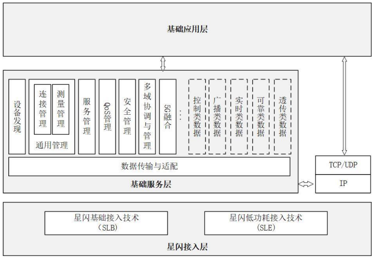
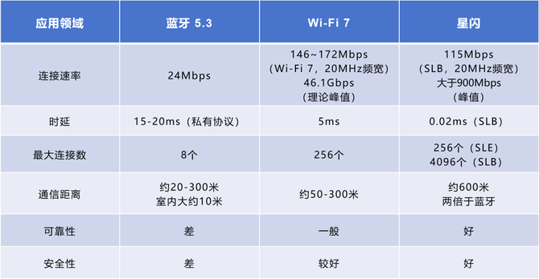
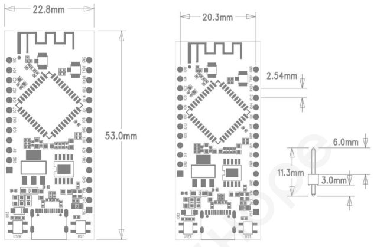

### 前言

​	哈喽，大家好，相信很多新手开发者都有一个疑问，什么是星闪？星闪技术相比于传统的WiFi和BLE有什么区别和优势？

​	首先，回答第一个问题，<font color='Peach'>星闪（NearLink）</font>，是中国原生的新一代无线短距通信技术。面向万物互联时代，星闪引入关键技术和创新理念，赋予智能终端新的连接方式。


<center>（图片来源：海思官网）</center>

​	第二个问题，我们从星闪的系统架构来看，在图中NearLink一共有**基础应用层、基础服务层、星闪接入层**。

**基础应用层：**

​	基础应用层用于实现各类应用功能、服务于不通过领域，包括智能座舱、智慧家居、智能终端、智能制造等不同场景。

**基础服务层：**

​	基础服务层除了设备与服务发现、QoS、实时流传输与控制、高安全等，NearLink还在这里实现了<font color='each '>多域协调与管理</font>和<font color='each'>5G融合</font>技术。

**星闪接入层：**

​	星闪接入层提供了<font color='Peach'>SparkLink Low Energy（SLE）</font>、<font color='Peach'>SparkLink Basic（SLB）</font>两种通信接口。SLE对标的是蓝牙，其特点是低功耗、低时延、高可靠；SLB对标的是WiFi，其特点是大带宽、大容量、大精度。



<center>NearLink系统架构（资料来源：星闪无线短距通信技术（SparkLink1.0）产业化推进白皮书）</center>

**星闪、WiFi、蓝牙参数对比**



<center>蓝牙5.3、WiFi 7、星闪参数对比（来源：鲜枣课堂《到底什么是“星闪”》）</center>

​	这里我们看一下星闪与WiFi和蓝牙的数据对比，从表中可以看到星闪在时延、最大连接数、通信距离都是“遥遥领先”。

### 润和W63E开发板

​	W63E核心板是润和基于海思WS63解决方案，在核心板上高度集成的2.4GHzWi-Fi&BLE&SLE的HH-SPARK-WS63模组的核心板。支持802.11b/g/n/ax协议，支持BLE5.3协议，BLE Mesh和BLE网关功能。支持SLE1.0协议，支持SLE网关功能。支持OpenHarmony轻量系统，适用于大小家电、电工照明等常电类物联网智能场景。（NearLink_DK_WS63与NearLink_DK_WS63E开发板的区别在于，<font color='Peach'>NearLink_DK_WS63E支持2.4GHz的雷达人体活动检测功能</font>）

​	NearLink_DK_WS63/WS63E具有以下特点：

​	* 稳定、可靠的通信能力

​	* 灵活的组网能力

​	* 完善的网络支持

​	* 强大的安全引擎

​	* 开放的操作系统


<center>WS63E核心板</center>

​	板载基本电路，包括CH340烧录电路、晶振电路、用户按键、LED等等，可以<font color='Blue'>实现一根Type-C数据线完成烧录、调试功能</font>。

#### 1.参数规格

| 模块      | 规格描述                                                     |
| :-------- | :----------------------------------------------------------- |
| CPU子系统 | * 高性能 32bit 微处理器，最大工作频率 240MHz<br />* 内嵌 SRAM 606KB、ROM 300KB<br />* 内嵌 4MB Flash |
| 外围接口  | * SPI x 1，QSPI x 1，I2C x 2，I2S x 1，UART x 3，GPIO x 19，ADC x 6,PWM x 8（上述接口通过复用实现）<br />* 外部晶振频率24MHz、40MHz |
| Software  | * Wi-Fi 模式 STA, Soft-AP and sniffer modes <br />* 安全机制 WPS / WEP / WPA / WPA2 / WPA3<br />* 加密类型 UART Download <br />* 软件开发 SDK <br />* 网络协议 IPv4, TCP/UDP/HTTP/FTP/MQTT |
| WiFi      | * 1×1 2.4GHz 频段（ch1～ch14）<br />* PHY支持 IEEE 802.11b/g/n/ax MAC 支持 IEEE 802.11d/e/i/k/v/w<br />* 支持 802.11n 20MHz/40MHz 频宽，支持 802.11ax 20MHz频宽<br />* 支持最大速率：150Mbps@HT40 MCS7， 114.7Mbps@HE20 MCS9<br />* 内置 PA 和 LNA，集成 TX/RX Switch、Balun 等<br />* 支持 STA 和 AP 形态，作为 AP 时最大支持 6 个 STA 接入<br />* 支持 A-MPDU、A-MSDU <br />* 支持 Block-ACK <br />* 支持 QoS，满足不同业务服务质量需求<br />* 支持 WPA/WPA2/WPA3 personal、WPS2.0 <br />* 支持 RF 自校准方案 <br />* 支持 STBC 和 LDPC<br />* <font color='Red'>支持雷达感知功能（仅限W63E）</font> |
| 蓝牙      | * 低功耗蓝牙 Bluetooth Low Energy（BLE）<br />* 支持 BLE 4.0/4.1/4.2/5.0/5.1/5.2 <br />* 支持 125Kbps、500Kbps、1Mbps、2Mbps 速率 <br />* 支持多路广播<br />* 支持 Class 1 <br />* 支持高功率 20dBm<br />* 支持 BLE Mesh，支持 BLE 网关 |
| 星闪      | * 星闪低功耗接入技术 Sparklink Low Energy（SLE）<br />* 支持 SLE 1.0<br />* 支持 SLE 1MHz/2MHz/4MHz，最大空口速率 12Mbps<br />* 支持 Polar 信道编码<br />* 支持 SLE 网关 |
| 其他信息  | * 电源电压输入：典型值5V<br />* 工作温度：-40℃～+85℃         |

<center>（来源：《NearLink_DK_WS63E 星闪开发板规格说明书_V1.0》）</center>

#### 2.WS63/WS63E星闪核心板功能布局


<center>（来源：《NearLink_DK_WS63E 星闪开发板规格说明书_V1.0》）</center>

#### 3.尺寸



<center>（来源：《NearLink_DK_WS63E 星闪开发板规格说明书_V1.0》）</center>

#### 4.功能框图


<center>（来源：《NearLink_DK_WS63E 星闪开发板规格说明书_V1.0》）</center>

#### 5.星闪派开发套件


​	星闪派物联网开发套件组件包括①WS63/WS63E核心板、②物联网底板、③显示板、④NFC板、⑤环境监测板、⑥智能红绿灯板、⑦智能（炫彩）灯板、⑧Type-C数据线。

#### 6.资料

**Gitee仓库**

```
https://gitee.com/hihope_iot/near-link
```

​	官方代码仓文件结构如下。

```
near-link
|---NearLink_DK_WS63                # WS63星闪开发板产品说明书和规格说明书
|---NearLink_DK_WS63E               # WS63E星闪开发板产品说明书和规格说明书
|---NearLink_Pi_IOT                 # 星闪派物联网开发套件使用说明书和规格说明书
|---OH-SDK                          # WS63-OH-SDK
|---demo                            # WS63开发板测试例程
  |---button_example    			# 按键中断测试例程
  |---demo_uart						# UART串口测试例程
  |---easy_wifi_demo                # wifi功能测试例程
  |---hello_world_demo              # i2c功能、OLED显示测试例程 
  |---led_demo                      # gpio功能测试例程 
  |---sle_uart_demo					# SLE串口测试例程
|---firmware                        
  |---WS63                          # WS63开发板烧录固件
|---tools                           # WS63开发板烧录工具
```

**海思社区**

星闪专区：https://developer.hisilicon.com/forum/0133146886267870001

Ubuntu环境搭建教程：https://developer.hisilicon.com/postDetail?tid=0269158574011338004

Docker环境配置教程：https://developer.hisilicon.com/postDetail?tid=0203158573698502004

**开发板购买**

【淘宝】https://m.tb.cn/h.gMYOYubi9LnWmiE?tk=leLR35rcbCs HU0025 「润和WS63E星闪开发板2.4GWiFi+BLE+SLE支持雷达感知及OpenHarmony」

**星闪开发者技术交流群**


