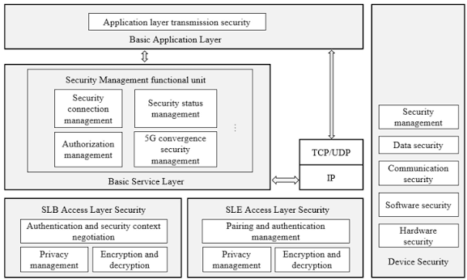
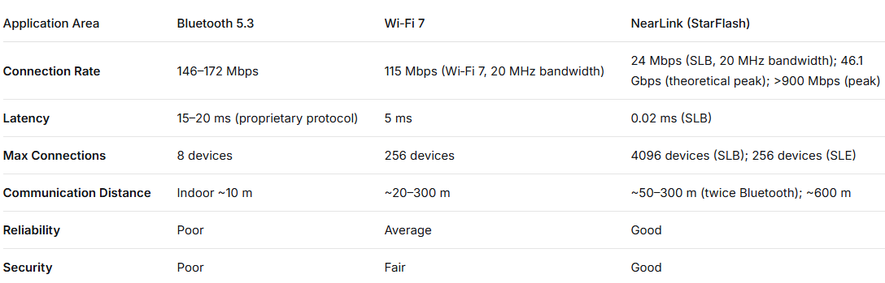
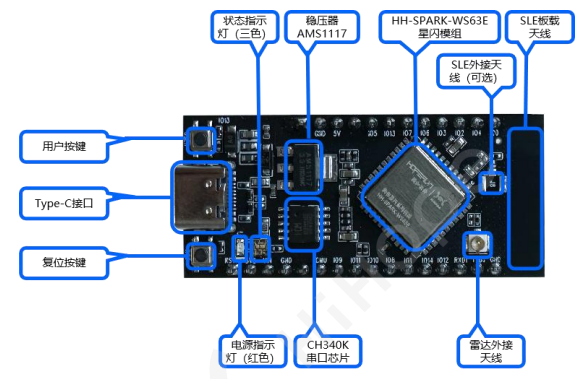
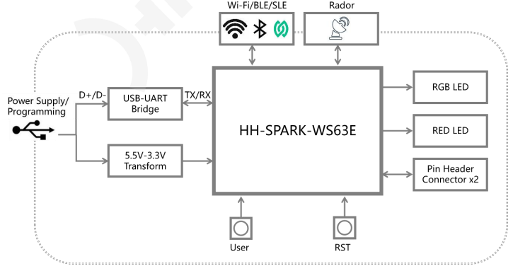
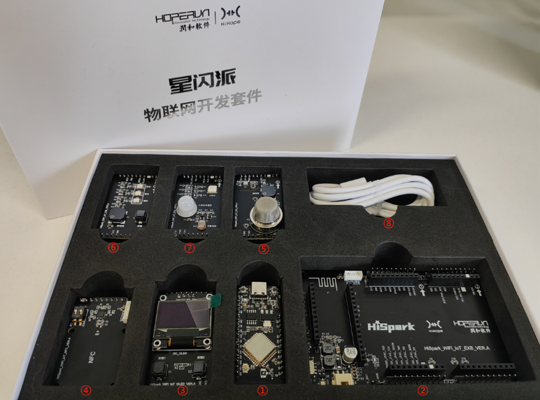

### Preface

Hello everyone, I believe many novice developers have a question: what is NearLink? What are the differences and advantages of NearLink technology compared to traditional WiFi and BLE?

To answer the first question, <font color='Peach'>NearLink (NearLink)</font> is a new generation of native Chinese wireless short-range communication technology. Aiming at the era of the Internet of Everything, NearLink introduces key technologies and innovative concepts, providing smart terminals with new connection methods.


The second question: From the system architecture of SparkLink, the diagram shows that NearLink consists of three layers: the **Basic Application Layer**, the **Basic Service Layer**, and the **SparkLink Access Layer**.

**Basic Application Layer:**

The Basic Application Layer is used to implement various application functions and serve different fields, including scenarios such as smart cockpits, smart homes, smart terminals, and smart manufacturing.

**Basic Service Layer:**

In addition to device and service discovery, QoS, real-time streaming transmission and control, and high security, NearLink also implements <font color='each '>multi-domain coordination and management</font> and <font color='each'>5G convergence</font> technologies at this layer.

**SparkLink Access Layer:**

The SparkLink Access Layer provides two communication interfaces: <font color='Peach'>SparkLink Low Energy (SLE)</font> and <font color='Peach'>SparkLink Basic (SLB)</font>. SLE is comparable to Bluetooth, characterized by low power consumption, low latency, and high reliability; SLB is comparable to WiFi, characterized by large bandwidth, large capacity, and high precision.



<center>NearLink System Architecture (Source: SparkLink Wireless Short-Range Communication Technology (SparkLink1.0) Industrialization Promotion White Paper)</center>

**Comparison of SparkLink, WiFi, and Bluetooth Parameters**



<center>Bluetooth 5.3, WiFi 7, and SparkLink Parameter Comparison (Source: Fresh Date Classroom "What Exactly Is 'SparkLink'")</center>

Here we look at the data comparison between SparkLink, WiFi, and Bluetooth. From the table, it can be seen that SparkLink is "far ahead" in terms of latency, maximum number of connections, and communication distance.

### YanLink YL63E Development Board

The YL63E core board is a core board from YanLink based on the YL63 solution, which highly integrates a 2.4GHz Wi-Fi & BLE & SLE module. It supports 802.11b/g/n/ax protocols, BLE5.3 protocol, BLE Mesh, and BLE gateway functions. It supports the SLE1.0 protocol and SLE gateway functions. It supports the OpenHarmony/Oniro lightweight system and is suitable for always-on IoT smart scenarios such as large and small appliances and lighting. (The difference between the YL63 and YL63E development boards is that <font color='Peach'>the YL63E supports 2.4GHz radar human activity detection</font>)

The YL63/YL63E has the following features:

* Stable and reliable communication capability

* Flexible networking capability

* Comprehensive network support

* Powerful security engine

* Open operating system


<center>YL63E Core Board</center>

The board integrates basic circuits, including a CH340 programming circuit, crystal oscillator circuit, user buttons, LEDs, etc., enabling <font color='Blue'>programming and debugging with just one Type-C data cable</font>.

#### 1. Specifications

| Module     | Specification Description                                    |
| :--------- | :----------------------------------------------------------- |
| CPU Subsystem | * High-performance 32-bit microprocessor, maximum operating frequency 240MHz<br />* Embedded SRAM 606KB, ROM 300KB<br />* Embedded 4MB Flash |
| Peripheral Interfaces | * SPI x 1, QSPI x 1, I2C x 2, I2S x 1, UART x 3, GPIO x 19, ADC x 6, PWM x 8 (The above interfaces are implemented through multiplexing)<br />* External crystal oscillator frequencies 24MHz, 40MHz |
| Software   | * Wi-Fi Modes STA, Soft-AP and sniffer modes <br />* Security Mechanisms WPS / WEP / WPA / WPA2 / WPA3<br />* Encryption Type UART Download <br />* Software Development SDK <br />* Network Protocols IPv4, TCP/UDP/HTTP/FTP/MQTT |
| WiFi       | * 1×1 2.4GHz band (ch1～ch14)<br />* PHY supports IEEE 802.11b/g/n/ax MAC supports IEEE 802.11d/e/i/k/v/w<br />* Supports 802.11n 20MHz/40MHz bandwidth, supports 802.11ax 20MHz bandwidth<br />* Supports maximum data rate: 150Mbps@HT40 MCS7, 114.7Mbps@HE20 MCS9<br />* Built-in PA and LNA, integrated TX/RX Switch, Balun, etc.<br />* Supports STA and AP modes, supports up to 6 STA connections when operating as AP<br />* Supports A-MPDU, A-MSDU <br />* Supports Block-ACK <br />* Supports QoS, meeting different service quality requirements<br />* Supports WPA/WPA2/WPA3 personal, WPS2.0 <br />* Supports RF self-calibration scheme <br />* Supports STBC and LDPC<br />* <font color='Red'>Supports radar sensing function (W63E only)</font> |
| Bluetooth  | * Bluetooth Low Energy (BLE)<br />* Supports BLE 4.0/4.1/4.2/5.0/5.1/5.2 <br />* Supports data rates of 125Kbps, 500Kbps, 1Mbps, 2Mbps <br />* Supports multi-casting<br />* Supports Class 1 <br />* Supports high power 20dBm<br />* Supports BLE Mesh, supports BLE Gateway |
| SparkLink  | * Sparklink Low Energy (SLE)<br />* Supports SLE 1.0<br />* Supports SLE 1MHz/2MHz/4MHz, maximum air interface data rate 12Mbps<br />* Supports Polar channel coding<br />* Supports SLE Gateway |
| Other Information | * Power Supply Voltage Input: Typical 5V<br />* Operating Temperature: -40℃～+85℃ |

<center>(Source: "YL63E SparkLink Development Board Specification Sheet_V1.0")</center>

#### 2. YL63/YL63E SparkLink Core Board Functional Layout



<center>(Source: "YL63E SparkLink Development Board Specification Sheet_V1.0")</center>

#### 3. Dimensions


<center>(Source: "YL63E Sparklink Development Board Specification Sheet_V1.0")</center>

#### 4. Functional Block Diagram



(Source: "YL63E SparkLink Development Board Specification Manual_V1.0")

#### 5. SparkLink Development Kit



The NearLink IoT development kit components include: ① YL63/YL63E core board, ② IoT base board, ③ display board, ④ NFC board, ⑤ environmental monitoring board, ⑥ smart traffic light board, ⑦ smart (colorful) light board, ⑧ Type-C data cable.

#### 6. Documentation

**Gitee Repository**

```
https://github.com/yanlinkOS/YanLink_OpenSource_Community/tree/main/NearLink
```

The official code repository file structure is as follows.

```
near-link
|---NearLink_DK_YL63                # YL63 NearLink development board product manual and specification sheet
|---NearLink_DK_YL63E               # YL63E NearLink development board product manual and specification sheet
|---NearLink_Pi_IOT                 # NearLink IoT development kit user manual and specification sheet
|---OH-SDK                          # YL63-OH-SDK
|---demo                            # YL63 development board test examples
  |---button_example                # Button interrupt test example
  |---demo_uart                     # UART serial port test example
  |---easy_wifi_demo                # WiFi function test example
  |---hello_world_demo              # I2C function, OLED display test example
  |---led_demo                      # GPIO function test example
  |---sle_uart_demo                 # SLE serial port test example
|---firmware                        
  |---YL63                          # YL63 development board firmware
|---tools                           # YL63 development board flashing tool
```
